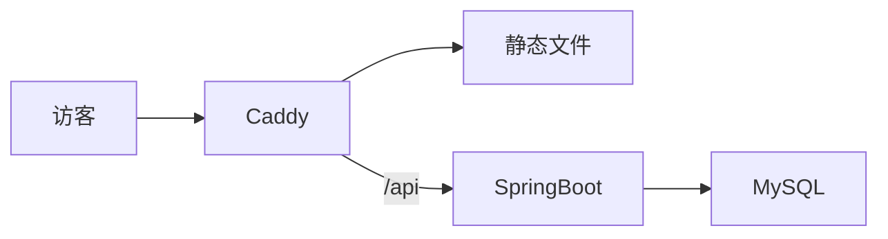

# 个人网站阶段一：VitePress 站点 + 部署上线 实现计划

> **For agentic workers:** REQUIRED SUB-SKILL: Use superpowers:subagent-driven-development (recommended) or superpowers:executing-plans to implement this plan task-by-task. Steps use checkbox (`- [ ]`) syntax for tracking.

**Goal:** 搭建 VitePress 静态站（首页/文章/系列/成果），通过 Docker + Caddy 部署到云服务器，GitHub Actions 实现 push 即发布。

**Architecture:** Monorepo。`site/` 为 VitePress 源码，构建产物经 GitHub Actions 传到服务器，Caddy 容器直接托管静态文件并自动处理 HTTPS。本阶段不含 SpringBoot 后端（阶段二单独计划）。

**Tech Stack:** VitePress 1.x + Vue 3、Caddy 2、Docker Compose、GitHub Actions。

**前置条件：**
- 本地：Node.js ≥ 20、npm。
- 服务器：Ubuntu，已装 Docker 与 Docker Compose 插件，安全组放行 80/443，域名 A 记录已解析到服务器 IP。
- GitHub：已创建空仓库（假设为 `github.com/your-name/vie`）。

## Global Constraints

- 包管理用 npm，依赖安装后不手改版本号，提交 `package-lock.json`。
- 所有面向访客的文案用中文。
- 文章 slug 规则：英文小写 + 连字符，不含日期；URL 与文件路径一一对应。
- 文章 frontmatter 规范（冻结）：

```yaml
---
title: 文章标题
date: 2026-08-25
tags: [标签1, 标签2]
series: 系列名          # 可选
description: 一句话摘要  # 用于 SEO meta 和列表页
draft: true             # 可选，草稿不发布
---
```

- commit 规范：`<type>: 中文描述`，type ∈ feat/fix/docs/chore/ci。
- 域名占位符：`your-domain.com`；GitHub 占位符：`your-name`。Task 11 会统一替换为真实值。

---

### Task 1: Monorepo 骨架

**Files:**
- Create: `.gitignore`
- Create: `site/.keep`（占位，Task 2 删除）

- [ ] **Step 1: 写 .gitignore**

```gitignore
node_modules/
dist/
*.log
.DS_Store
site/.vitepress/cache/
site/.vitepress/dist/
deploy/.env
```

- [ ] **Step 2: 建立目录并把默认分支改为 main**

```bash
mkdir site
git branch -M main
git add .gitignore
git commit -m "chore: monorepo 骨架与 gitignore"
```

---

### Task 2: VitePress 脚手架与基础配置

**Files:**
- Create: `site/package.json`
- Create: `site/.vitepress/config.mts`
- Create: `site/index.md`
- Delete: `site/.keep`

**Interfaces:**
- Produces: `npm run dev`（开发）、`npm run build`（产物在 `site/.vitepress/dist`）两个命令，后续所有任务依赖。

- [ ] **Step 1: 写 package.json**

```json
{
  "name": "vie-site",
  "private": true,
  "type": "module",
  "scripts": {
    "dev": "vitepress dev",
    "build": "vitepress build",
    "preview": "vitepress preview"
  }
}
```

- [ ] **Step 2: 安装依赖**

```bash
cd site
npm install -D vitepress vue @types/node
```

预期：生成 `node_modules/` 与 `package-lock.json`。

- [ ] **Step 3: 写基础配置 `site/.vitepress/config.mts`**

```ts
import { defineConfig } from 'vitepress'

export const SITE_URL = 'https://your-domain.com' // 部署前改为真实域名

export default defineConfig({
  title: 'VIE',
  titleTemplate: ':title | VIE',
  description: '技术实现细节与思路',
  lang: 'zh-CN',
  cleanUrls: true,
  lastUpdated: true,
  themeConfig: {
    nav: [
      { text: '首页', link: '/' },
      { text: '文章', link: '/articles/' },
      { text: '系列', link: '/series/' },
      { text: '成果', link: '/projects' },
    ],
    search: { provider: 'local' },
    socialLinks: [{ icon: 'github', link: 'https://github.com/your-name' }],
    outline: { label: '本页目录' },
    lastUpdated: { text: '最后更新' },
    docFooter: { prev: '上一篇', next: '下一篇' },
  },
})
```

- [ ] **Step 4: 写占位首页 `site/index.md`**

```md
---
layout: home
hero:
  name: VIE
  text: 写清楚每一个技术决策
  tagline: 全栈开发 · 技术实现细节与思路
---

占位内容，Task 5 完成首页。
```

- [ ] **Step 5: 验证构建**

```bash
cd site
npm run build
```

预期：成功，`site/.vitepress/dist/index.html` 存在。再 `npm run dev` 打开 http://localhost:5173 能看到 hero 首页，Ctrl+C 停止。

- [ ] **Step 6: Commit**

```bash
git add site
git rm site/.keep
git commit -m "feat(site): VitePress 脚手架与基础配置"
```

---

### Task 3: 自定义主题入口与全局样式

**Files:**
- Create: `site/.vitepress/theme/index.ts`
- Create: `site/.vitepress/theme/custom.css`
- Create: `site/.vitepress/theme/Layout.vue`

**Interfaces:**
- Produces: 主题入口默认导出 `{ extends, Layout, enhanceApp }`；`Layout.vue` 提供 `doc-before` 插槽渲染文章元信息（Task 7 填充阅读时长，Task 9 填充系列导航）。全局注册的组件在后续 Task 逐个加入 `enhanceApp`。

- [ ] **Step 1: 写 `site/.vitepress/theme/Layout.vue`**

```vue
<script setup lang="ts">
import DefaultTheme from 'vitepress/theme'
import { useData } from 'vitepress'

const { Layout } = DefaultTheme
const { frontmatter } = useData()
</script>

<template>
  <Layout>
    <template #doc-before>
      <div v-if="frontmatter.date" class="post-meta">
        <time>{{ frontmatter.date }}</time>
      </div>
    </template>
  </Layout>
</template>
```

- [ ] **Step 2: 写 `site/.vitepress/theme/index.ts`**

```ts
import DefaultTheme from 'vitepress/theme'
import Layout from './Layout.vue'
import './custom.css'

export default {
  extends: DefaultTheme,
  Layout,
  enhanceApp({ app }) {
    // 后续 Task 在此注册全局组件
  },
}
```

- [ ] **Step 3: 写 `site/.vitepress/theme/custom.css`**

```css
:root {
  --vp-c-brand-1: #3a6ea5;
  --vp-c-brand-2: #4d82bd;
  --vp-c-brand-3: #6b9bd1;
}

.post-meta {
  color: var(--vp-c-text-2);
  font-size: 0.9rem;
  margin-bottom: 1rem;
}

.post-list {
  list-style: none;
  padding: 0;
}

.post-list li {
  padding: 0.75rem 0;
  border-bottom: 1px solid var(--vp-c-divider);
}

.post-list a {
  font-weight: 600;
  color: var(--vp-c-text-1);
  text-decoration: none;
}

.post-list a:hover {
  color: var(--vp-c-brand-1);
}

.post-list .meta {
  color: var(--vp-c-text-2);
  font-size: 0.85rem;
  margin-left: 0.5rem;
}
```

- [ ] **Step 4: 验证**

```bash
cd site
npm run build
```

预期：构建成功；`npm run dev` 后首页样式正常（品牌色变化）。

- [ ] **Step 5: Commit**

```bash
git add site/.vitepress/theme
git commit -m "feat(site): 自定义主题入口与全局样式"
```

---

### Task 4: 文章数据加载器、文章列表页与示例文章

**Files:**
- Create: `site/.vitepress/posts.ts`
- Create: `site/articles.data.ts`
- Create: `site/.vitepress/theme/components/ArticleList.vue`
- Create: `site/articles/index.md`
- Create: `site/articles/meta/how-this-site-works.md`
- Modify: `site/.vitepress/theme/index.ts`（注册 ArticleList）

**Interfaces:**
- Produces: `Post` 类型与 `toPost()`（`site/.vitepress/posts.ts`），Task 5/9 复用；`articles.data` 默认导出 + 命名导出 `data: Post[]`（按日期降序）。

- [ ] **Step 1: 写 `site/.vitepress/posts.ts`**

```ts
import type { ContentData } from 'vitepress'

export interface Post {
  title: string
  url: string
  date: string
  description: string
  tags: string[]
  series?: string
  category: string
  wordCount: number
  readingTime: number
}

export function toPost(p: ContentData): Post | null {
  const fm = p.frontmatter
  if (!fm.title || !fm.date || fm.draft) return null
  const body = (p.src ?? '').replace(/^---[\s\S]*?---/, '')
  const wordCount = body.replace(/\s/g, '').length
  return {
    title: fm.title,
    url: p.url.replace(/\.html$/, ''),
    date: fm.date,
    description: fm.description ?? '',
    tags: fm.tags ?? [],
    series: fm.series,
    category: p.url.split('/')[2] ?? 'misc',
    wordCount,
    readingTime: Math.max(1, Math.ceil(wordCount / 400)),
  }
}
```

- [ ] **Step 2: 写 `site/articles.data.ts`**

```ts
import { createContentLoader } from 'vitepress'
import { toPost, type Post } from './.vitepress/posts'

declare const data: Post[]
export { data }

export default createContentLoader('articles/**/*.md', {
  transform(raw): Post[] {
    return raw
      .map(toPost)
      .filter((p): p is Post => p !== null)
      .sort((a, b) => +new Date(b.date) - +new Date(a.date))
  },
})
```

- [ ] **Step 3: 写 `site/.vitepress/theme/components/ArticleList.vue`**

```vue
<script setup lang="ts">
import { computed } from 'vue'
import { data as posts } from '../../../articles.data'

const grouped = computed(() => {
  const map = new Map<string, typeof posts>()
  for (const post of posts) {
    map.set(post.category, [...(map.get(post.category) ?? []), post])
  }
  return [...map.entries()]
})
</script>

<template>
  <section v-for="[category, list] in grouped" :key="category">
    <h2>{{ category }}</h2>
    <ul class="post-list">
      <li v-for="post in list" :key="post.url">
        <a :href="post.url">{{ post.title }}</a>
        <span class="meta">{{ post.date }} · 约 {{ post.readingTime }} 分钟</span>
        <p v-if="post.description">{{ post.description }}</p>
      </li>
    </ul>
  </section>
</template>
```

- [ ] **Step 4: 写 `site/articles/index.md`**

```md
---
title: 文章
---

<ArticleList />
```

- [ ] **Step 5: 写示例文章 `site/articles/meta/how-this-site-works.md`**

```md
---
title: 这个网站是怎么搭起来的
date: 2026-08-25
tags: [vitepress, 建站]
series: 个人网站开发实录
description: 个人网站的技术选型与搭建过程记录。
---

## 为什么这样选

（正文占位：记录 VitePress + SpringBoot 的选型理由。）

## 架构

（正文占位：整体架构说明。）
```

- [ ] **Step 6: 在 `theme/index.ts` 的 `enhanceApp` 中注册组件**

```ts
import ArticleList from './components/ArticleList.vue'
// enhanceApp({ app }) 内：
app.component('ArticleList', ArticleList)
```

- [ ] **Step 7: 验证**

```bash
cd site
npm run build
```

预期：构建成功；dev 下 `/articles/` 显示 `meta` 分类及示例文章，点击可进入文章页，文章页顶部显示日期。

- [ ] **Step 8: Commit**

```bash
git add site
git commit -m "feat(site): 文章数据加载器、列表页与示例文章"
```

---

### Task 5: 首页最新文章模块

**Files:**
- Create: `site/.vitepress/theme/components/LatestArticles.vue`
- Modify: `site/index.md`
- Modify: `site/.vitepress/theme/index.ts`（注册 LatestArticles）

**Interfaces:**
- Consumes: `articles.data` 的 `data: Post[]`（Task 4）。

- [ ] **Step 1: 写 `LatestArticles.vue`**

```vue
<script setup lang="ts">
import { data as posts } from '../../../articles.data'

const latest = posts.slice(0, 5)
</script>

<template>
  <div class="home-section">
    <h2>最新文章</h2>
    <ul class="post-list">
      <li v-for="post in latest" :key="post.url">
        <a :href="post.url">{{ post.title }}</a>
        <span class="meta">{{ post.date }} · 约 {{ post.readingTime }} 分钟</span>
      </li>
    </ul>
    <p><a href="/articles/">全部文章 →</a></p>
  </div>
</template>

<style scoped>
.home-section {
  max-width: 1152px;
  margin: 0 auto;
  padding: 0 24px 3rem;
}
</style>
```

- [ ] **Step 2: 更新 `site/index.md`，在 hero 后挂载组件**

```md
---
layout: home
hero:
  name: VIE
  text: 写清楚每一个技术决策
  tagline: 全栈开发 · 技术实现细节与思路
  actions:
    - theme: brand
      text: 阅读文章
      link: /articles/
    - theme: alt
      text: 查看成果
      link: /projects
---

<LatestArticles />
```

- [ ] **Step 3: 注册组件并验证**

`theme/index.ts` 的 `enhanceApp` 加 `app.component('LatestArticles', LatestArticles)`，然后：

```bash
cd site
npm run build
```

预期：构建成功；首页 hero 下方显示最新文章列表（含示例文章）。

- [ ] **Step 4: Commit**

```bash
git add site
git commit -m "feat(site): 首页最新文章模块"
```

---

### Task 6: 成果展示页

**Files:**
- Create: `site/projects.data.ts`
- Create: `site/.vitepress/theme/components/Projects.vue`
- Create: `site/projects.md`
- Create: `site/public/projects/.gitkeep`
- Modify: `site/.vitepress/theme/index.ts`（注册 Projects）

**Interfaces:**
- Produces: `Project` 类型与 `projects` 数组；成果截图放 `site/public/projects/`，引用路径 `/projects/<文件名>`。

- [ ] **Step 1: 写 `site/projects.data.ts`**

```ts
export interface Project {
  name: string
  description: string
  image?: string
  tags: string[]
  github?: string
  demo?: string
  featured: boolean
}

export const projects: Project[] = [
  {
    name: '个人网站',
    description: 'VitePress + SpringBoot 搭建的个人技术站，含访问量统计与自动发布流水线。',
    tags: ['VitePress', 'SpringBoot', 'Docker', 'GitHub Actions'],
    github: 'https://github.com/your-name/vie',
    demo: 'https://your-domain.com',
    featured: true,
  },
]
```

- [ ] **Step 2: 写 `Projects.vue`**

```vue
<script setup lang="ts">
import { projects } from '../../../projects.data'
</script>

<template>
  <div class="project-grid">
    <div v-for="p in projects" :key="p.name" class="project-card">
      
      <h3>{{ p.name }}</h3>
      <p>{{ p.description }}</p>
      <p class="tags">
        <span v-for="t in p.tags" :key="t" class="tag">{{ t }}</span>
      </p>
      <p class="links">
        <a v-if="p.github" :href="p.github" target="_blank" rel="noopener">GitHub</a>
        <a v-if="p.demo" :href="p.demo" target="_blank" rel="noopener">在线 Demo</a>
      </p>
    </div>
  </div>
</template>

<style scoped>
.project-grid {
  display: grid;
  grid-template-columns: repeat(auto-fill, minmax(300px, 1fr));
  gap: 1.25rem;
  margin-top: 1.5rem;
}
.project-card {
  border: 1px solid var(--vp-c-divider);
  border-radius: 8px;
  padding: 1.25rem;
}
.project-card img {
  width: 100%;
  border-radius: 4px;
}
.tag {
  display: inline-block;
  background: var(--vp-c-bg-soft);
  border-radius: 4px;
  padding: 0.1rem 0.5rem;
  margin: 0 0.4rem 0.4rem 0;
  font-size: 0.8rem;
}
.links a {
  margin-right: 1rem;
}
</style>
```

- [ ] **Step 3: 写 `site/projects.md`**

```md
---
title: 成果
aside: false
---

<Projects />
```

- [ ] **Step 4: 注册组件并验证**

`enhanceApp` 加 `app.component('Projects', Projects)`，然后 `npm run build`。预期：构建成功；`/projects` 显示项目卡片。

- [ ] **Step 5: Commit**

```bash
git add site
git commit -m "feat(site): 成果展示页"
```

---

### Task 7: 文章页阅读时长与字数

**Files:**
- Modify: `site/.vitepress/theme/Layout.vue`

**Interfaces:**
- Consumes: `frontmatter.date`（Task 3 已渲染）。

- [ ] **Step 1: 修改 `Layout.vue`，客户端统计正文字数**

```vue
<script setup lang="ts">
import DefaultTheme from 'vitepress/theme'
import { useData } from 'vitepress'
import { onMounted, ref } from 'vue'

const { Layout } = DefaultTheme
const { frontmatter } = useData()

const wordCount = ref(0)
const readingTime = ref(0)

onMounted(() => {
  const el = document.querySelector('.vp-doc')
  if (!el) return
  const n = (el.textContent ?? '').replace(/\s/g, '').length
  wordCount.value = n
  readingTime.value = Math.max(1, Math.ceil(n / 400))
})
</script>

<template>
  <Layout>
    <template #doc-before>
      <div v-if="frontmatter.date" class="post-meta">
        <time>{{ frontmatter.date }}</time>
        <span v-if="readingTime"> · 约 {{ readingTime }} 分钟（{{ wordCount }} 字）</span>
      </div>
    </template>
  </Layout>
</template>
```

- [ ] **Step 2: 验证**

`npm run build` 成功；dev 下打开示例文章，顶部显示"日期 · 约 X 分钟（Y 字）"。

- [ ] **Step 3: Commit**

```bash
git add site/.vitepress/theme/Layout.vue
git commit -m "feat(site): 文章页阅读时长与字数统计"
```

---

### Task 8: Mermaid 图表支持

**Files:**
- Modify: `site/.vitepress/config.mts`
- Modify: `site/articles/meta/how-this-site-works.md`（加入示例图表）

- [ ] **Step 1: 安装插件**

```bash
cd site
npm install -D vitepress-plugin-mermaid mermaid
```

- [ ] **Step 2: 用 `withMermaid` 包裹配置**

`config.mts` 改为：

```ts
import { defineConfig } from 'vitepress'
import { withMermaid } from 'vitepress-plugin-mermaid'

export const SITE_URL = 'https://your-domain.com' // 部署前改为真实域名

export default withMermaid(
  defineConfig({
    // …原有配置保持不变…
    mermaid: {},
  })
)
```

- [ ] **Step 3: 示例文章中加入 Mermaid 代码块**

在 `how-this-site-works.md` 的"架构"小节下加入：

````md

````

- [ ] **Step 4: 验证**

`npm run build` 成功；dev 下文章页架构图渲染为流程图而非代码块。

- [ ] **Step 5: Commit**

```bash
git add site
git commit -m "feat(site): Mermaid 图表支持"
```

---

### Task 9: 系列功能（聚合页 + 文章内系列导航）

**Files:**
- Create: `site/series.data.ts`
- Create: `site/series/index.md`
- Create: `site/series/[name].paths.ts`
- Create: `site/series/[name].md`
- Create: `site/.vitepress/theme/components/SeriesIndex.vue`
- Create: `site/.vitepress/theme/components/SeriesPage.vue`
- Create: `site/.vitepress/theme/components/SeriesNav.vue`
- Modify: `site/.vitepress/theme/index.ts`（注册 SeriesIndex、SeriesPage）
- Modify: `site/.vitepress/theme/Layout.vue`（doc-before 挂 SeriesNav）

**Interfaces:**
- Consumes: `toPost`/`Post`（Task 4）。
- Produces: `series.data` 命名导出 `data: SeriesGroup[]`，其中 `SeriesGroup = { name: string; posts: Post[] }`，组内按日期升序。

- [ ] **Step 1: 写 `site/series.data.ts`**

```ts
import { createContentLoader } from 'vitepress'
import { toPost, type Post } from './.vitepress/posts'

export interface SeriesGroup {
  name: string
  posts: Post[]
}

declare const data: SeriesGroup[]
export { data }

export function groupBySeries(posts: Post[]): SeriesGroup[] {
  const map = new Map<string, Post[]>()
  for (const p of posts) {
    if (!p.series) continue
    map.set(p.series, [...(map.get(p.series) ?? []), p])
  }
  return [...map.entries()].map(([name, posts]) => ({ name, posts }))
}

export default createContentLoader('articles/**/*.md', {
  transform(raw): SeriesGroup[] {
    const posts = raw
      .map(toPost)
      .filter((p): p is Post => p !== null)
      .sort((a, b) => +new Date(a.date) - +new Date(b.date))
    return groupBySeries(posts)
  },
})
```

- [ ] **Step 2: 写动态路由 `site/series/[name].paths.ts`**

```ts
import { createContentLoader } from 'vitepress'
import { toPost, type Post } from '../.vitepress/posts'
import { groupBySeries } from '../series.data'

export default {
  async paths() {
    const raw = await createContentLoader('articles/**/*.md').load()
    const posts = raw
      .map(toPost)
      .filter((p): p is Post => p !== null)
      .sort((a, b) => +new Date(a.date) - +new Date(b.date))
    return groupBySeries(posts).map((g) => ({
      params: { name: g.name, posts: g.posts },
    }))
  },
}
```

- [ ] **Step 3: 写 `site/series/[name].md`**

```md
---
title: 系列
aside: false
---

<SeriesPage :name="$params.name" :posts="$params.posts" />
```

- [ ] **Step 4: 写 `SeriesPage.vue`**

```vue
<script setup lang="ts">
import type { Post } from '../../../.vitepress/posts'

defineProps<{ name: string; posts: Post[] }>()
</script>

<template>
  <h1>{{ name }}</h1>
  <ol class="post-list">
    <li v-for="post in posts" :key="post.url">
      <a :href="post.url">{{ post.title }}</a>
      <span class="meta">{{ post.date }} · 约 {{ post.readingTime }} 分钟</span>
      <p v-if="post.description">{{ post.description }}</p>
    </li>
  </ol>
</template>
```

- [ ] **Step 5: 写 `SeriesIndex.vue` 与 `site/series/index.md`**

```vue
<script setup lang="ts">
import { data as groups } from '../../../series.data'
</script>

<template>
  <ul class="post-list">
    <li v-for="g in groups" :key="g.name">
      <a :href="`/series/${encodeURIComponent(g.name)}`">{{ g.name }}</a>
      <span class="meta">共 {{ g.posts.length }} 篇</span>
    </li>
  </ul>
</template>
```

```md
---
title: 系列
aside: false
---

<SeriesIndex />
```

- [ ] **Step 6: 写 `SeriesNav.vue`（文章页内上一篇/下一篇）**

```vue
<script setup lang="ts">
import { computed } from 'vue'
import { useData } from 'vitepress'
import { data as groups } from '../../../series.data'

const { page, frontmatter } = useData()

const nav = computed(() => {
  const name = frontmatter.value.series
  if (!name) return null
  const group = groups.find((g) => g.name === name)
  if (!group) return null
  const current = '/' + page.value.relativePath.replace(/\.md$/, '')
  const idx = group.posts.findIndex((p) => p.url === current)
  if (idx === -1) return null
  return {
    name,
    prev: idx > 0 ? group.posts[idx - 1] : null,
    next: idx < group.posts.length - 1 ? group.posts[idx + 1] : null,
  }
})
</script>

<template>
  <div v-if="nav" class="series-nav">
    <p>
      本文属于系列
      <a :href="`/series/${encodeURIComponent(nav.name)}`">《{{ nav.name }}》</a>
    </p>
    <p>
      <a v-if="nav.prev" :href="nav.prev.url">← {{ nav.prev.title }}</a>
      <a v-if="nav.next" :href="nav.next.url" class="next">{{ nav.next.title }} →</a>
    </p>
  </div>
</template>

<style scoped>
.series-nav {
  border: 1px solid var(--vp-c-divider);
  border-radius: 8px;
  padding: 0.75rem 1rem;
  margin-bottom: 1.5rem;
  font-size: 0.9rem;
}
.series-nav .next {
  float: right;
}
</style>
```

- [ ] **Step 7: 注册组件并挂到 Layout**

`theme/index.ts` 的 `enhanceApp` 加：

```ts
app.component('SeriesIndex', SeriesIndex)
app.component('SeriesPage', SeriesPage)
```

`Layout.vue` 的 `doc-before` 插槽在 `.post-meta` 后加：

```vue
<SeriesNav v-if="frontmatter.series" />
```

（同时在 script 中 `import SeriesNav from './components/SeriesNav.vue'`。）

- [ ] **Step 8: 验证**

`npm run build` 成功；dev 下：
- `/series/` 列出"个人网站开发实录"；
- `/series/个人网站开发实录` 显示系列文章列表；
- 示例文章页顶部出现系列导航框。

- [ ] **Step 9: Commit**

```bash
git add site
git commit -m "feat(site): 系列聚合页与文章内系列导航"
```

---

### Task 10: SEO 三件套（sitemap、RSS、robots.txt）

**Files:**
- Create: `site/.vitepress/seo.ts`
- Create: `site/public/robots.txt`
- Modify: `site/.vitepress/config.mts`（buildEnd 钩子）

- [ ] **Step 1: 安装依赖**

```bash
cd site
npm install -D feed gray-matter
```

- [ ] **Step 2: 写 `site/.vitepress/seo.ts`**

```ts
import fs from 'node:fs'
import path from 'node:path'
import matter from 'gray-matter'
import { Feed } from 'feed'
import { SITE_URL } from './config.mts'

interface SiteConfig {
  outDir: string
  srcDir: string
  pages: string[]
}

export async function generateSitemap(siteConfig: SiteConfig) {
  const urls = siteConfig.pages
    .filter((p) => !p.includes('[') && p !== '404.md')
    .map((p) => p.replace(/(^|\/)index\.md$/, '$1').replace(/\.md$/, ''))
    .map((p) => `${SITE_URL}/${p}`)
  const xml = `<?xml version="1.0" encoding="UTF-8"?>
<urlset xmlns="http://www.sitemaps.org/schemas/sitemap/0.9">
${urls.map((u) => `  <url><loc>${u}</loc></url>`).join('\n')}
</urlset>
`
  await fs.promises.writeFile(path.join(siteConfig.outDir, 'sitemap.xml'), xml)
}

export async function generateFeed(siteConfig: SiteConfig) {
  const articlesDir = path.join(siteConfig.srcDir, 'articles')
  const files = (
    await fs.promises.readdir(articlesDir, { recursive: true })
  ).filter((f): f is string => typeof f === 'string' && f.endsWith('.md'))

  const feed = new Feed({
    title: 'VIE',
    description: '技术实现细节与思路',
    id: SITE_URL,
    link: SITE_URL,
    language: 'zh-CN',
    feedLinks: { rss2: `${SITE_URL}/feed.xml` },
    copyright: '',
  })

  const items: { title: string; url: string; description: string; date: Date }[] = []
  for (const file of files) {
    const raw = await fs.promises.readFile(path.join(articlesDir, file), 'utf8')
    const { data: fm } = matter(raw)
    if (!fm.title || !fm.date || fm.draft) continue
    const slug = file.replace(/\\/g, '/').replace(/\.md$/, '')
    items.push({
      title: fm.title,
      url: `${SITE_URL}/articles/${slug}`,
      description: fm.description ?? '',
      date: new Date(fm.date),
    })
  }
  items.sort((a, b) => +b.date - +a.date)
  for (const item of items.slice(0, 20)) {
    feed.addItem({
      title: item.title,
      id: item.url,
      link: item.url,
      description: item.description,
      date: item.date,
    })
  }
  await fs.promises.writeFile(path.join(siteConfig.outDir, 'feed.xml'), feed.rss2())
}
```

- [ ] **Step 3: 写 `site/public/robots.txt`**

```txt
User-agent: *
Allow: /
Disallow: /stats-view

Sitemap: https://your-domain.com/sitemap.xml
```

- [ ] **Step 4: 在 `config.mts` 中加 buildEnd 钩子**

`defineConfig({...})` 内追加：

```ts
async buildEnd(siteConfig) {
  const { generateSitemap, generateFeed } = await import('./seo')
  await generateSitemap(siteConfig)
  await generateFeed(siteConfig)
},
```

- [ ] **Step 5: 验证**

```bash
cd site
npm run build
```

预期：构建成功；`site/.vitepress/dist/sitemap.xml` 含首页与示例文章 URL；`dist/feed.xml` 含示例文章条目；`dist/robots.txt` 存在。

- [ ] **Step 6: Commit**

```bash
git add site
git commit -m "feat(site): sitemap、RSS 与 robots.txt"
```

---

### Task 11: 部署配置与服务器初始化

**Files:**
- Create: `deploy/Caddyfile`
- Create: `deploy/docker-compose.yml`
- Create: `deploy/.env.example`

- [ ] **Step 1: 写 `deploy/Caddyfile`**

```caddyfile
{$DOMAIN} {
	root * /srv/site
	encode zstd gzip

	try_files {path} {path}.html {path}/index.html
	file_server

	header {
		Strict-Transport-Security "max-age=31536000; includeSubDomains"
		X-Content-Type-Options "nosniff"
		X-Frame-Options "DENY"
		Referrer-Policy "strict-origin-when-cross-origin"
	}

	handle_errors {
		rewrite * /404.html
		file_server
	}
}

www.{$DOMAIN} {
	redir https://{$DOMAIN}{uri} permanent
}
```

- [ ] **Step 2: 写 `deploy/docker-compose.yml`**

```yaml
services:
  caddy:
    image: caddy:2-alpine
    restart: unless-stopped
    ports:
      - "80:80"
      - "443:443"
    volumes:
      - ./Caddyfile:/etc/caddy/Caddyfile:ro
      - ./site-dist:/srv/site:ro
      - caddy-data:/data
      - caddy-config:/config

volumes:
  caddy-data:
  caddy-config:
```

- [ ] **Step 3: 写 `deploy/.env.example`**

```env
DOMAIN=your-domain.com
```

- [ ] **Step 4: 本地把占位符替换为真实值**

把 `site/.vitepress/config.mts` 的 `SITE_URL`、`site/public/robots.txt` 的 Sitemap 行、`site/projects.data.ts` 的 demo 链接中的 `your-domain.com` 替换为真实域名；`config.mts` 与 `projects.data.ts` 中的 `your-name` 替换为真实 GitHub 用户名。

- [ ] **Step 5: 服务器一次性初始化（手动，逐条执行）**

```bash
# 1. 安装 Docker（Ubuntu）
curl -fsSL https://get.docker.com | sh
sudo usermod -aG docker $USER   # 重新登录后生效

# 2. 拉取代码
sudo mkdir -p /opt/vie && sudo chown $USER /opt/vie
git clone https://github.com/your-name/vie.git /opt/vie/app

# 3. 配置环境
cd /opt/vie/app/deploy
cp .env.example .env
# 编辑 .env，把 DOMAIN 改为真实域名

# 4. 准备空站点目录并启动
mkdir -p site-dist
docker compose up -d
```

- [ ] **Step 6: 本地构建并手动上传首版（验证部署链路）**

```bash
cd site
npm run build
scp -r .vitepress/dist/* <服务器用户>@<服务器IP>:/opt/vie/app/deploy/site-dist/
```

预期：浏览器访问 `https://<真实域名>` 显示首页，HTTPS 证书自动签发成功（Caddy 首次签发约需几十秒），`/articles/`、`/projects`、`/series/` 均可访问，`/feed.xml`、`/sitemap.xml` 可下载。

- [ ] **Step 7: Commit**

```bash
git add deploy site
git commit -m "feat(deploy): Caddy + Docker Compose 部署配置"
git push -u origin main
```

---

### Task 12: GitHub Actions 自动发布流水线

**Files:**
- Create: `.github/workflows/deploy.yml`

- [ ] **Step 1: 配置 GitHub Secrets**

仓库 Settings → Secrets and variables → Actions，新增：
- `SERVER_HOST`：服务器 IP
- `SERVER_USER`：SSH 用户名
- `SERVER_SSH_KEY`：专用私钥（本地 `ssh-keygen -t ed25519 -f gh-deploy` 生成，公钥追加到服务器 `~/.ssh/authorized_keys`）

- [ ] **Step 2: 写 `.github/workflows/deploy.yml`**

```yaml
name: deploy

on:
  push:
    branches: [main]

jobs:
  site:
    runs-on: ubuntu-latest
    steps:
      - uses: actions/checkout@v4

      - uses: actions/setup-node@v4
        with:
          node-version: 20
          cache: npm
          cache-dependency-path: site/package-lock.json

      - name: 构建静态站
        working-directory: site
        run: |
          npm ci
          npm run build

      - name: 上传产物到临时目录
        uses: appleboy/scp-action@v0.1.7
        with:
          host: ${{ secrets.SERVER_HOST }}
          username: ${{ secrets.SERVER_USER }}
          key: ${{ secrets.SERVER_SSH_KEY }}
          source: "site/.vitepress/dist/*"
          target: /opt/vie/app/deploy/site-dist-new
          strip_components: 3

      - name: 原子切换站点目录
        uses: appleboy/ssh-action@v1.2.0
        with:
          host: ${{ secrets.SERVER_HOST }}
          username: ${{ secrets.SERVER_USER }}
          key: ${{ secrets.SERVER_SSH_KEY }}
          script: |
            set -e
            cd /opt/vie/app/deploy
            rm -rf site-dist-old
            [ -d site-dist ] && mv site-dist site-dist-old || true
            mv site-dist-new site-dist
```

- [ ] **Step 3: 验证自动发布**

修改示例文章任意一句话，push 到 main：

```bash
git add .
git commit -m "ci: GitHub Actions 自动发布流水线"
git push
```

预期：GitHub Actions 绿灯（约 1~2 分钟）；刷新网站能看到修改后的内容。

---

## 阶段一验收清单

- [ ] 首页/文章/系列/成果四个栏目均可访问，样式正常
- [ ] 示例文章含 Mermaid 图、阅读时长、系列导航
- [ ] `/feed.xml`、`/sitemap.xml`、`/robots.txt` 可访问
- [ ] 全站 HTTPS，www 301 到裸域
- [ ] push 到 main 后 2 分钟内自动上线

## 后续计划（本计划不包含）

- 阶段二：SpringBoot 统计 API（`page_view` 表、`/api/track`、`/api/stats/summary`）+ `/stats-view` 查看页 + Caddy 反代 `/api` + compose 增加 app/mysql 容器 + 每日 mysqldump 备份
- 阶段三：2~3 篇种子文章撰写、Search Console 接入、社交入口挂载
