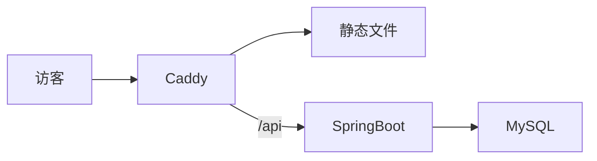

# 面试官 3 分钟可验证 — Design Spec

日期：2026-08-26  
站点：Vie（`vie-vibe.cn`）  
状态：已对齐范围；待实现

## 1. 问题

站点壳（Bento 首页、分类文章、系列、成果、RSS/sitemap、后台统计）已经能跑。面试官点进来仍会撞上：

- 8 篇文章里大量「样本 / 正文占位」，无法核对真实技术决策
- 4 张成果卡指向同一个 GitHub，像拆开的演示数据
- `PRODUCT.md` 写了本地搜索，`config.mts` 未开启
- `feed.xml` 已生成，页面 `<head>` 未声明
- 分享卡片没有 OG（title / description / 图）

成功标准：面试官 3 分钟内能读到定位、一篇真文、一个真项目；文章可被搜索与分享；构建能拦住空壳内容再次混进仓库。

## 2. 范围

### 做

1. 系列《个人网站开发实录》4 篇按仓库实现写实（总览、主题、统计 API、CI）。
2. 其余 4 篇（DTO、Redis 取舍、阅读时长、Caddy）同样去样本化。URL、标题、分类、`series` 字段不变。
3. 成果收敛为 1 个项目 **Vie**，带决策摘要与首页截图。
4. 首页：thesis 下加定位句；两张空掉的次要项目卡改成系列入口 + 总览文章入口。
5. 发现三件套：VitePress 本地搜索、RSS `rel=alternate`、文章/整站 OG（共用一张默认图）。
6. 内容守卫脚本：缺 `description`、正文过短、残留「占位/样本」时失败；接入 `site` 的 npm script 与 CI 构建前。

### 不做

评论、登录、后台、多语言、邮件订阅、个人简介页、新 URL、标签页、相关文章、阅读进度条、JSON-LD、自托管字体、项目独立笔记页、公开访问量、探测 `/api` 把首页 `live` 做成真健康检查。

## 3. 约束（全局）

- 产品名展示 **Vie**（V 大写，ie 小写）；域名/仓库可仍为 vie。
- 定位句：写清楚每一个技术决策。
- URL 冻结：`/`、`/articles/`、`/projects`、`/series/`、隐藏 `/stats-view`。
- 原则：内容质量 > 视觉呈现 > 功能复杂度。
- 技术栈保持：VitePress 1.6 + Vue 3 主题，不新增运行时依赖（`gray-matter` / `feed` 已有）。允许新增 `site/scripts/check-content.mjs`（Node 内置模块 + 已有 `gray-matter`）。
- 统计仍仅后台；前台不展示访问数据。
- 尊重 `prefers-reduced-motion`（不新增未受控动画）。
- Git 提交不得带 `Co-authored-by: Cursor`。

## 4. 架构

仍是静态站 + 同域 API。本迭代只动 `site/` 内容与主题、以及 CI 里站点 job 多一步内容检查。

```text
面试官
  → 首页 HomeBento（定位 + 1 个 featured 项目 + 系列/总览入口）
  → /articles/*  Markdown（决策日志）
  → /projects    单卡 Vie + 决策摘要（链回文章）
搜索 / 分享
  → VitePress local search
  → transformHead：RSS alternate + OG
  → public/images/vie-home.png（截图兼 OG 图）
守卫
  → node scripts/check-content.mjs  （dev 与 CI）
```

边界：

| 单元 | 职责 | 依赖 |
|------|------|------|
| `projects.data.ts` | 唯一项目源；`Project` 类型 | 无 |
| `Projects.vue` | 成果页渲染决策摘要与截图 | `projects.data` |
| `HomeBento.vue` | 首页定位、featured、系列/总览格 | posts / projects / series |
| `seo.ts` | sitemap、RSS、`headTagsForPage()` | `SITE_URL` |
| `config.mts` | search、`transformHead` | `seo.ts` |
| `scripts/check-content.mjs` | 构建前内容契约 | `gray-matter`、articles、projects.data |
| 8 篇 Markdown | 可验证决策 | 仓库真实路径 |

## 5. 首页

结构保持现有 Bento：status bar → thesis（span 7）→ featured ship（span 5）→ metrics（span 5）→ latest post → feed → **两格 span 4** → terminal。

**Thesis 磁贴（顺序）**

1. tab `src/index.tsx`
2. 现有注释：`// 全栈开发 · 技术实现细节与思路`
3. 主标题 thesis（不变）
4. **新定位行**（`vie-code-comment vie-mono`，不当 H2）：  
   `// 应届 · 全栈 · 文章是决策日志，成果是上线证明`
5. 技术栈 chips
6. CTA（不变）

文案写死在 `HomeBento.vue`，不新开配置文件。

**次要两格（替换 `secondaryProjects`）**

- 格 A：系列《个人网站开发实录》。tab `series/log`；badge `series`；展示篇数；整卡 `<a>` 指向 `/series/个人网站开发实录`（与现有 `SeriesIndex` 相同，使用 `encodeURIComponent`）。
- 格 B：总览文《这个网站是怎么搭起来的》。tab `articles/meta`；badge `read`；整卡 `<a>` 指向该文 `url`（从 `posts` 里 `url` 包含 `how-this-site-works` 的项读取，禁止手写错 URL）。

无系列或无总览文时，对应格不渲染（不编造第二项目）。

**Metrics**

- tab：`metrics/`（去掉 `sample`）
- `aria-label`：`站点规模`（去掉「样本」）
- 删除注释 `// 静态样本数据，上线后替换`
- `posts` / `series` / `ships` 仍用真实数组长度（ships 应为 1）
- `live` 仍为静态文案，本迭代不探测 API

**Featured 项目卡**

- 继续用 `projects.find(p => p.featured) ?? projects[0]`
- 首页**不**渲染 `decisions`（短卡）
- 若 `lead.github` / `lead.demo` 存在则保留 gh/demo

**可访问**

- 两格次要卡必须是链接，键盘可聚焦；标题用 `h2`
- 定位行对屏幕阅读器可见（不要 `aria-hidden`）

## 6. 成果

### 数据

`site/projects.data.ts` 只保留一条：

```ts
export interface ProjectDecision {
  text: string
  href?: string
}

export interface Project {
  name: string
  description: string
  image?: string
  tags: string[]
  github?: string
  demo?: string
  featured: boolean
  decisions?: ProjectDecision[]
}
```

唯一记录：

- `name`: `Vie`
- `description`: `VitePress 静态站 + 同域 SpringBoot 统计 + Caddy / GitHub Actions 发布。`
- `tags`: `VitePress`, `Vue 3`, `SpringBoot`, `Docker`, `GitHub Actions`
- `github`: `https://github.com/creatawork/vie-vibe`
- `demo`: `https://vie-vibe.cn`
- `featured`: `true`
- `image`: `/images/vie-home.png`（文件在截图任务落地后存在；落地前可暂不设 `image`，卡片不得出现破图）
- `decisions`（顺序固定）：
  1. `静态站 SSG，而不是 SSR` → `/articles/meta/how-this-site-works`
  2. `统计自建，IP 只存日盐哈希` → `/articles/backend/springboot-stats-api`
  3. `CI 拆 site 与 server 两个 job，静态目录原子切换` → `/articles/devops/github-actions-deploy`
  4. `首页用 Bento，不用 VitePress 默认 Hero` → `/articles/frontend/vitepress-theme`

### 成果页 UI

`Projects.vue` 在描述与 chips 之后、gh/demo 之前渲染决策列表：有 `href` 用站内 `<a>`，无则纯文本。沿用 `vie-feed` 行号样式。截图 `v-if="p.image"` 保持不变。

## 7. 文章写实

### 共同规则

- 保留现有 `title` / `date` / `tags` / `series`（有则保留）/ 文件路径。
- 重写 `description`：一句人话，**禁止**出现「样本」「占位」。
- 正文必须能对照仓库：点名文件或类名（如 `deploy/Caddyfile`、`TrackRequest`、`.github/workflows/deploy.yml`）。
- 结构：决策 → 做法（含路径）→ 不做什么（边界）。
- 全文去掉「样本」「正文占位」「静态模拟」等演示口吻。
- 中文为主；代码/路径保持原名。
- 系列顺序（`series.data` 按 date 升序）：Caddy(08-05) 不在系列内；系列内为 主题(08-18) → 统计 API(08-20) → CI(08-15 日期早于主题，**不改 date**，系列页按现有 date 排序)。不在本迭代重排日期，以免 RSS 与「最后更新」叙事混乱。总览 `how-this-site-works` date `2026-08-25` 仍为系列里最新一篇，作为收束。

### 各篇要点（正文全文见附录 A）

| 文件 | 必须写到的真实事实 |
|------|-------------------|
| `articles/meta/how-this-site-works.md` | VitePress SSG vs SSR；Caddy 同域 `/api`；目录 `site/` `server/` `deploy/` |
| `articles/frontend/vitepress-theme.md` | `Layout.vue` 插槽；`HomeBento`；`custom.css` vs `vie-bento.css`；不用 `layout: home` |
| `articles/backend/springboot-stats-api.md` | `POST /api/track`、`GET /api/stats/summary`；`TrackRequest` vs `PageView`；日盐 HMAC IP；30s 去重；60/min；summary 60s 内存缓存；口令 + KeyGuard |
| `articles/devops/github-actions-deploy.md` | 双 job；`mvn verify`；dist 原子切换；Caddy `--force-recreate` 因为 bind mount inode |
| `articles/devops/caddy-reverse-proxy.md` | 真实 `deploy/Caddyfile`：`app:8080`、`try_files`、安全头、www 301 |
| `articles/backend/dto-vs-entity.md` | `TrackRequest` / `PageView` / `Summary` 三层；对外不回表结构 |
| `articles/notes/redis-cache-pattern.md` | 单实例进程内 60s cache；不引入 Redis 的条件；多实例才考虑 |
| `articles/meta/reading-time-wordcount.md` | `toPost` 去 YAML 后 `replace(/\s/g,'')` / 400；`Layout.vue` 客户端对 `.vp-doc` 再算；允许略有差异 |

## 8. 发现层

### 搜索

`themeConfig.search.provider: 'local'`。中文 translations：按钮「搜索」、无结果「没有找到」。不改 URL。搜索框使用 VitePress 默认 UI，不自制。

### RSS 声明 + OG

在 `site/.vitepress/seo.ts` 新增 `headTagsForPage(pageData)`，`config.mts` 的 `transformHead` 调用它。每页注入：

- `link rel="alternate" type="application/rss+xml" href="{SITE_URL}/feed.xml" title="Vie RSS"`
- `og:site_name` = `Vie`
- `og:title` / `og:description` / `og:url` / `og:type`（文章为 `article`，其余 `website`）
- `og:image` = `{SITE_URL}/images/vie-home.png`
- `twitter:card` = `summary_large_image`，同步 title/description/image

`og:description` 优先 `frontmatter.description`，否则站点 `description`「技术实现细节与思路」。

文章判定：`relativePath` 以 `articles/` 开头且不是 `articles/index.md`。

规范化 URL：去掉 `index.md` 与 `.md`，与现有 sitemap 规则一致。

RSS `Feed` 的 `title` 从 `VIE` 改为 `Vie`。

### 默认图

`site/public/images/vie-home.png`：首页 1280×800 实拍（桌面视口）。同时作成果截图与 OG。没有该文件时成果卡不渲染 ``；OG 标签仍指向该 URL，因此截图必须在本迭代内产出，避免分享破图。

## 9. 内容守卫

新建 `site/scripts/check-content.mjs`，失败时 `process.exit(1)` 并打印文件路径。

检查：

1. 每篇 `articles/**/*.md`（不含 `articles/index.md`）：有非空 `title`、`date`、`description`（≥ 12 个字）；正文去 frontmatter 后去空白字符数 ≥ 400；正文与 description 均不含：`正文占位`、`样本`、`静态模拟`。
2. 动态 import `projects.data.ts` 不可靠（Vite loader）；改为脚本内用正则/约定读取该文件导出的数组字面量**过于脆**。改为：`check-content.mjs` 读取 `projects.data.ts` 文本，断言：
   - 只出现一次 `name: '` 项目名（精确：`name: 'Vie'` 恰好一次）
   - 包含 `featured: true`
   - 包含至少 3 处 `href: '/articles/`
3. `HomeBento.vue` 含定位句全文：`应届 · 全栈 · 文章是决策日志，成果是上线证明`
4. `config.mts` 含 `provider: 'local'`
5. `seo.ts` 含 `rel: 'alternate'` 与 `og:description`

`site/package.json` 增加 `"check:content": "node scripts/check-content.mjs"`。  
`.github/workflows/deploy.yml` 的 `site` job 在 `npm ci` 之后、`npm run build` 之前执行 `npm run check:content`。

## 10. 错误处理

- 搜索无结果：VitePress 默认文案（已译）。
- 项目无图：不渲染 img。
- 系列/总览缺失：首页对应格不显示，不抛错。
- `check:content` 失败：CI 红，不发布。
- OG 图 404：靠本迭代必须提交 png 避免；不写运行时回退逻辑。

## 11. 测试

无前端测试框架，不为此引入 Vitest。

- **契约测试**：`npm run check:content`（见 §9）。
- **构建**：`npm run build` 成功；`dist/index.html` 含 RSS alternate 与定位句；`dist/feed.xml` 的 `<title>` 含 `Vie`；存在本地搜索资源（构建产物中有 `localSearch` 或 `VPLocalSearch` 相关文件）。
- **人工**：桌面与 ≤900px 首页 Bento 不断裂；`/projects` 四条决策可点进文章；导航搜索能搜到「Caddy」。

## 12. DESIGN.md 同步

`Layout` 一节改为：Home 磁贴含 thesis、featured ship、metrics、latest、feed、**系列入口、总览文章入口**、terminal；不再写「次要项目卡」。其余视觉 token 不变。

---

## 附录 A — 文章正文（实现时整文件替换）

实现必须使用下列全文，不要再发挥成另一套叙事。frontmatter 已含在内。

### A.1 `site/articles/meta/how-this-site-works.md`

````markdown
---
title: 这个网站是怎么搭起来的
date: 2026-08-25
tags: [vitepress, 建站]
series: 个人网站开发实录
description: 为什么用 VitePress 静态站加同域 SpringBoot，而不是做成 SSR 应用。
---

## 为什么这样选

面向面试官的站点，内容以 Markdown 决策日志为主，更新频率远低于产品站。VitePress 构建出静态文件，Caddy 直接提供，没有 Node 常驻、也没有用户会话。需要服务端的只有访问统计：放在同域 `/api`，由 SpringBoot 写入 MySQL。

不选 Next/Nuxt SSR 的原因是没登录、没有个性化页面，SSR 的运维面（进程、缓存、错误页）换不来对应收益。统计不接第三方脚本，是为了数据留在自己的库里，并能在文章里把表结构、限流和口令守卫讲清楚。

## 架构

仓库三块：`site/` 主题与文章，`server/` 统计 API，`deploy/` 里 Caddy、Compose 与发布目录。GitHub Actions 在 `main` 上跑两个互不阻塞的 job：构建并上传静态 `dist`，以及 `mvn verify` 后滚动 `app` 容器。



浏览器只打 `vie-vibe.cn`。页面是静态的，埋点 `POST /api/track` 因此没有跨域。统计查看在隐藏路由 `/stats-view`，口令走查询参数，前台不展示 PV。

## 边界

不做评论、账号、CMS。文章进 Git，发布即构建。这是本站其余文章的前提：下面每一篇都对应这里的某一层。
````

### A.2 `site/articles/frontend/vitepress-theme.md`

```markdown
---
title: VitePress 主题定制与 vibe 布局
date: 2026-08-18
tags: [vitepress, vue, css]
series: 个人网站开发实录
description: 用 Layout 插槽和 Bento 首页换掉默认 Hero，样式拆成 token 与磁贴两层。
---

## 决策

VitePress 默认 `layout: home` 的 Hero 适合文档产品，不适合「打开就能扫到定位和最新文章」。首页 Markdown 只挂 `<HomeBento />`，识别度来自磁贴、语法色和 Vie 字标，而不是再套一层终端皮肤。

## 怎么挂进去

`site/.vitepress/theme/index.ts` 扩展默认主题，替换 `Layout`。`Layout.vue` 只做三件事：字标插到 `nav-bar-title-before`，文章页 `doc-before` 里写日期/字数/系列，以及挂 `SeriesNav`。列表页自己包 `VieShell`，不和首页抢结构。

## 样式分层

- `custom.css`：颜色 token、导航、文章阅读面板、字数行。
- `vie-bento.css`：首页 grid、磁贴、feed、成果卡、统计页。

组件边界：`HomeBento.vue` 只组首页；`ArticleList` / `Projects` / `SeriesIndex` 共用 `VieShell`。新增列表页时先套壳，再加一种磁贴，避免第三份布局语言。

## 边界

不改 VitePress 的文章 HTML 管线。代码高亮、目录、上一篇下一篇走默认主题；我们只在外壳上表达 vibe-coding。阅读面板颜色和点阵底在 `DESIGN.md`，改视觉先改 token，再动组件。
```

### A.3 `site/articles/backend/springboot-stats-api.md`

```markdown
---
title: SpringBoot 统计接口怎么设计
date: 2026-08-20
tags: [springboot, api, mysql]
series: 个人网站开发实录
description: 同域上报 PV、日盐哈希 UV、内存缓存汇总，口令接口与页面写入分离。
---

## 需求边界

前台只上报路径和 `referrer`，见 `site/.vitepress/theme/track.ts`。后台用口令拉汇总。不做实时大屏，前台也不渲染访问数字。

## 接口与模型

`StatsController` 挂在 `/api`：

| 方法 | 路径 | 说明 |
|------|------|------|
| POST | `/api/track` | 上报一次浏览，成功 `204` |
| GET | `/api/stats/summary?key=` | 汇总、30 日趋势、Top 页；口令错误 `401`，连续失败封禁 `429` |

写入用 `TrackRequest(path, referrer)` 入参 DTO，持久化是 `PageView` 实体（`path`、`referrer`、`source`、`ip_hash`、`created_at`）。汇总形状是只读 `Summary`，不会把实体列表丢给浏览器。

## 隐私与限流

原始 IP 不入库。`IpHasher` 用当天日期加 `IP_SECRET` 做 HMAC-SHA256，次日哈希换盐，避免长期追踪。同一 `ip_hash + path` 30 秒内去重；按 IP 每分钟最多 60 次写入（`RateLimiter`）。`summary()` 进程内缓存 60 秒，单实例足够，查询不必每次扫全表细节。

口令来自环境变量 `STATS_KEY`，由 `KeyGuard` 对失败次数计数。密钥只在服务器 `.env`，不进 Git。

## 为什么自建

第三方脚本会把阅读行为送出站点，也很难写进「我如何设计接口」这种面试叙事。自建的代价是要自己做校验、去重和口令，这些代价有对应代码：`StatsService.track` 与 `StatsController.summary`。
```

### A.4 `site/articles/devops/github-actions-deploy.md`

```markdown
---
title: GitHub Actions 自动发布到 VPS
date: 2026-08-15
tags: [github-actions, deploy, docker]
series: 个人网站开发实录
description: site 与 server 分成两个 job，静态目录先写新再切，失败时旧 dist 仍可服务。
---

## 为什么拆成两个 job

`.github/workflows/deploy.yml` 在 `main` 上并行：

- `server`：`server/` 下 `mvn -B verify`，把 `server.jar` scp 到 `/opt/vie/app/deploy`，再 `docker compose up -d --build app`。
- `site`：`site/` 下 `npm ci`，先 `npm run check:content` 拦住空壳文章，再 `npm run build`，把 `site/.vitepress/dist/*` 传到 `site-dist-new`。

前端改文不该等 Java 测试；后端改限流不该重传整站静态资源。密钥用 `SERVER_HOST` / `SERVER_USER` / `SERVER_SSH_KEY`，仓库里没有口令。

## 静态站怎么做到可回退

SSH 脚本把现有 `site-dist` 改名为 `site-dist-old`，再把 `site-dist-new` 改成 `site-dist`。Caddy 的 `./site-dist:/srv/site` 是 bind mount，目录 inode 变了进程仍握着旧挂载，所以必须 `docker compose up -d --force-recreate caddy`。若构建失败，job 在上传前红掉，服务器上的 `site-dist` 不会被半套文件替换。

## 边界

没有自动回滚 jar 的第二套槽位：`app` 是 `--build` 后直接 up。静态站有 `site-dist-old` 可人工切回。这是有意的不对称——页面更新更频繁，也更需要原子切换。
```

### A.5 `site/articles/devops/caddy-reverse-proxy.md`

````markdown
---
title: Caddy 反代静态站与 API
date: 2026-08-05
tags: [caddy, docker, devops]
description: 同域根路径走静态文件，/api 反代 app 容器，顺带自动 HTTPS 与安全头。
---

## 目标

浏览器只访问 `vie-vibe.cn`。静态页和埋点同站，不必配 CORS，Cookie 策略也简单。配置在 `deploy/Caddyfile`，域名来自 Compose 的 `DOMAIN`。

## 实际分流

```caddy
{$DOMAIN} {
	root * /srv/site
	encode zstd gzip

	handle /api/* {
		reverse_proxy app:8080
	}

	try_files {path} {path}.html {path}/index.html
	file_server
}
```

`/api/*` 进 `app:8080`（Compose 服务名，不是宿主机 localhost）。其余 `try_files` 适配 VitePress 的 `cleanUrls`：先文件，再 `.html`，再目录 `index.html`。`www.{$DOMAIN}` 301 到裸域。

## TLS 与错误页

Caddy 自动 HTTPS，证书在 `caddy-data` 卷。响应头加上 HSTS、`nosniff`、`DENY` frame、`strict-origin-when-cross-origin`。`handle_errors` 把错误改写到 `/404.html`，避免 API 失败时露出默认文本页。

反代目标必须是 Docker 网络里的 `app`。写 `localhost:8080` 会打到 Caddy 容器自己，统计接口会全部 502。
````

### A.6 `site/articles/backend/dto-vs-entity.md`

```markdown
---
title: DTO 和 Entity 什么时候拆
date: 2026-08-10
tags: [springboot, design]
description: 统计 API 把上报入参、表实体和汇总 VO 分开，避免把表字段直接暴露给页面。
---

## 这个项目里的三层

- 入参：`TrackRequest` 只有 `path` 与 `referrer`，对应 `POST /api/track` 的 JSON。
- 实体：`PageView` 另有 `source`、`ip_hash`、`created_at`，这些由服务端计算，客户端不许传。
- 出参：`Summary` 是聚合后的 PV/UV、按日趋势、Top 路径，不是 `List<PageView>`。

## 什么时候必须拆

对外字段和表字段不一致时：例如 UV 用哈希而不是 IP，来源用解析后的 `source` 而不是原始 referrer 长串。还要在入参上做校验（路径必须以 `/` 开头、长度 ≤ 512），这些规则不属于实体。

## 什么时候可以先不拆

内部一次性脚本、没有外部调用方的表，先用实体跑通再抽 DTO 也可以。本站的统计从第一天就有浏览器调用方，所以第一天就拆了。

`/api/stats/summary` 如果直接序列化 `PageView`，等于把哈希和原始 referrer 形态泄露到口令泄漏时的响应里。VO 把泄漏面收成聚合数字。
```

### A.7 `site/articles/notes/redis-cache-pattern.md`

```markdown
---
title: 本地缓存 vs Redis：个人项目怎么选
date: 2026-08-08
tags: [redis, cache, notes]
description: 单实例汇总接口用 60 秒内存缓存；没有多进程共享需求时不引入 Redis。
---

## 场景

`StatsService.summary()` 要算 30 天趋势和 Top 页，读多写少。部署是 Compose 里一个 `app` 容器，没有水平扩展。

## 实际选择

`StatsService` 用 `volatile Summary cached` 加时间戳，60 秒内重复请求直接返回。`track()` 成功写入后把 `cached = null`，避免新 PV 最长脏读超过缓存窗口加一次写入。

| 条件 | 选择 |
|------|------|
| 单实例、读多写少 | 进程内缓存（当前） |
| 多个 API 副本要共享同一份汇总 | Redis 存日汇总 |
| 只有静态站、没有 API | 没有缓存层 |

## 什么时候才加 Redis

出现第二个 `app` 副本，或 summary 的计算明显超过 60 秒窗口仍打满数据库时。现在加 Redis 要多一个容器、一套失效策略，而失效已经靠写路径清空内存引用解决了。文章只把边界写清，不预埋客户端代码。
```

### A.8 `site/articles/meta/reading-time-wordcount.md`

```markdown
---
title: 阅读时长与字数怎么算
date: 2026-08-12
tags: [vitepress, meta]
description: 列表用构建期去掉 YAML 后的字符数，正文页用浏览器对 .vp-doc 再数一遍。
---

## 列表里的数字

`site/.vitepress/posts.ts` 的 `toPost`：去掉 frontmatter 后对正文 `replace(/\s/g, '')` 得到字符数（中文按字，英文按字符，空格不计）。阅读时长 `Math.max(1, Math.ceil(wordCount / 400))`，400 是本站常数，偏中文阅读。

## 正文页为什么再算一次

`Layout.vue` 在客户端查 `.vp-doc` 的 `textContent`，用同一套去空白和 400 字/分钟。构建期 loader 拿的是 Markdown 源，客户端拿的是渲染后的 DOM（含代码块、表格、组件注入的字）。两者可以差几十到几百字。

## 接受差异

列表用来扫文、RSS 和首页卡片；页内数字用来读这页时心里有个数。不把其中一个回写成 frontmatter，以免每次改主题都要重算 Git 历史。若以后要完全一致，只保留构建期字段并在 Layout 读取 `articles.data`，那是另一次改动。当前实现里两处常数必须同为 400，改一处就要改另一处。
```

## 13. 实现顺序（摘要）

1. `Project` 类型与单条数据；`Projects.vue` 决策列表  
2. `HomeBento` 定位句 + 系列/总览格 + metrics 文案  
3. `seo.ts` head 标签 + `config.mts` 搜索与 `transformHead`；Feed 标题  
4. 八篇文章按附录 A 替换  
5. `check-content.mjs` + npm script + CI  
6. 预览截图写入 `site/public/images/vie-home.png`，补上 `image` 字段  
7. 更新 `DESIGN.md`

详细步骤、完整代码与验收命令见 `docs/superpowers/plans/2026-08-26-interviewer-proof.md`。
