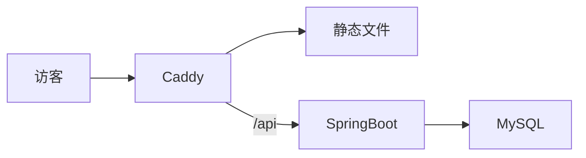

## 为什么这样选

面向面试官的站点，内容以 Markdown 决策日志为主，更新频率远低于产品站。VitePress 构建出静态文件，Caddy 直接提供，没有 Node 常驻、也没有用户会话。需要服务端的只有访问统计：放在同域 `/api`，由 SpringBoot 写入 MySQL。

不选 Next/Nuxt SSR 的原因是没登录、没有个性化页面，SSR 的运维面（进程、缓存、错误页）换不来对应收益。统计不接第三方脚本，是为了数据留在自己的库里，并能在文章里把表结构、限流和口令守卫讲清楚。

## 架构

仓库三块：`site/` 主题与文章，`server/` 统计 API，`deploy/` 里 Caddy、Compose 与发布目录。GitHub Actions 在 `main` 上跑两个互不阻塞的 job：构建并上传静态 `dist`，以及 `mvn verify` 后滚动 `app` 容器。

浏览器只打 `vie-vibe.cn`。页面是静态的，埋点 `POST /api/track` 因此没有跨域。统计查看在隐藏路由 `/stats-view`，口令走查询参数，前台不展示 PV。

## 边界

不做评论、账号、CMS。文章进 Git，发布即构建。这是本站其余文章的前提：下面每一篇都对应这里的某一层。
